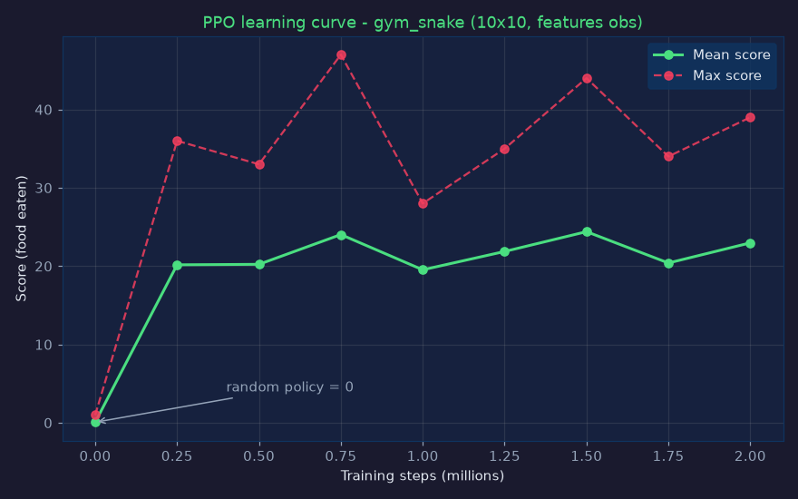
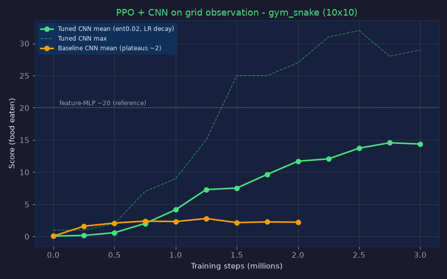
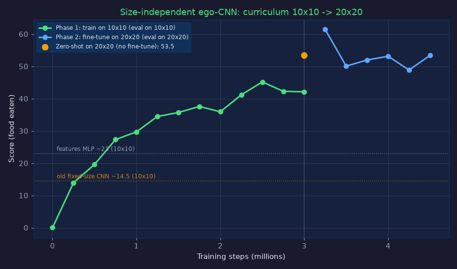
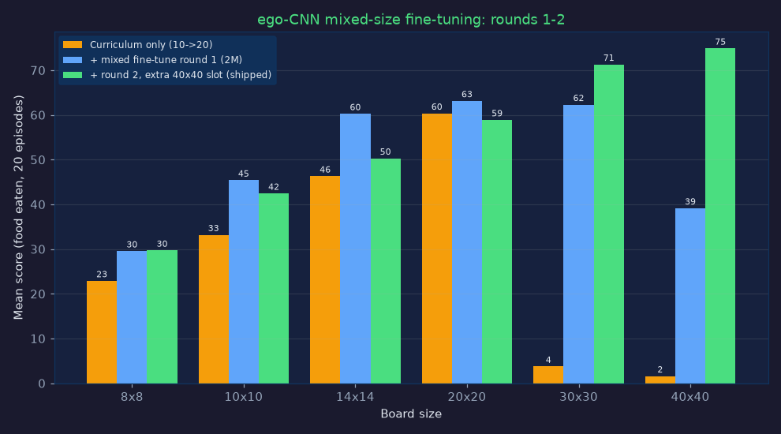
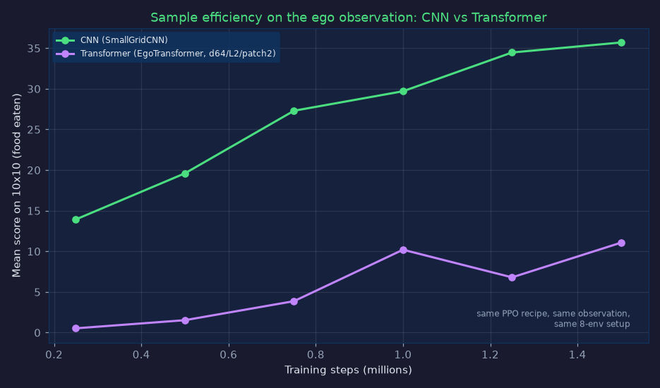
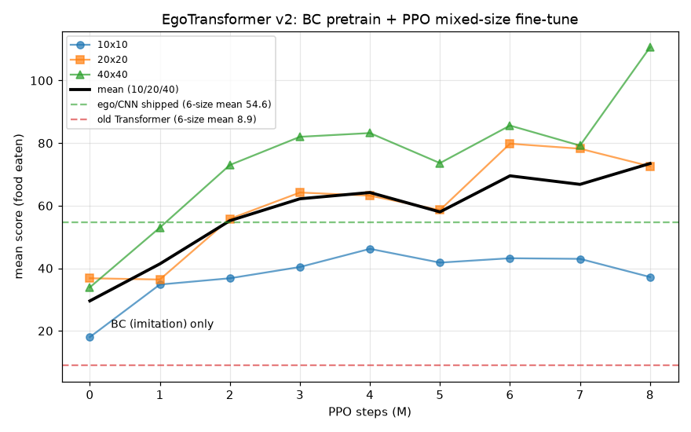

# PPO 学習結果 — gym_snake

`gym_snake/Snake-v0` を Stable-Baselines3 の PPO で学習させた結果です。
3種類の観測（`features` / `grid` / `ego`）でそれぞれ学習しています。

- **`features` (MLP)** … このページ下部。11次元の特徴ベクトル観測。
- **`grid` (CNN)** … [grid観測 + CNN の結果](#grid観測--cnn-の結果) を参照（`ego` に置き換え済み）。
- **`ego` (CNN・サイズ非依存)** … [ego観測 + CNN の結果](#ego観測--cnn-の結果サイズ非依存) を参照。**現在の推奨CNN**。

---

## `features` 観測 (MLP) の結果

## 設定

| 項目 | 値 |
|------|------|
| アルゴリズム | PPO (`MlpPolicy`) |
| 盤面 | 10 × 10 |
| 観測 | `features`（11次元ベクトル） |
| 並列環境数 | 8 |
| 総ステップ数 | 2,000,000 |
| 主なハイパラ | `n_steps=512`, `batch_size=512`, `gamma=0.99`, `gae_lambda=0.95`, `ent_coef=0.01`, `lr=3e-4` |
| 学習時間 | 約 300 秒（CPU, 8並列） |

## 学習曲線



`deterministic=True` で各チェックポイント30エピソードを評価した平均スコアです。
（スコア = 食べたエサの数）

| ステップ | 平均スコア | 最大スコア | 平均リターン |
|---------:|----------:|----------:|-----------:|
| 0 (ランダム) | 0.07 | 1 | -1.11 |
| 250,000 | 20.17 | 36 | 24.34 |
| 500,000 | 20.23 | 33 | 24.37 |
| 750,000 | 24.03 | 47 | 29.06 |
| 1,000,000 | 19.53 | 28 | 23.63 |
| 1,250,000 | 21.87 | 35 | 26.27 |
| 1,500,000 | 24.40 | 44 | 29.48 |
| 1,750,000 | 20.40 | 34 | 24.49 |
| 2,000,000 | 22.97 | 39 | 27.81 |

- **ランダム方策のスコアは 0** → 25万ステップで平均20点に急上昇し、以降は平均20〜24点で安定。
- 10×10（最大スコア97）で **平均約23点・最大47点**。エージェントは壁と自分を避けつつエサを追い、盤面をとぐろ状に埋める挙動を学習しました。

## 学習済みモデルでのプレイ例（スコア36）

```
+----------+
|..........|
|oooo......|
|o..o......|
|o..o......|
|o..o.*....|
|o..o......|
|o..oooooo.|
|ooooooo@o.|
|ooo....oo.|
|..oooooo..|
+----------+   @=頭 o=体 *=エサ
```

## 再現方法

```bash
pip install -e ".[train]"
python examples/train_sb3.py --obs features --grid 10 --timesteps 2000000
```

学習済みモデル `ppo_snake_features.zip` の読み込みと評価:

```python
import gymnasium as gym, gym_snake
from stable_baselines3 import PPO

model = PPO.load("examples/ppo_snake_features.zip")
env = gym.make("gym_snake/Snake-v0", grid_size=10, obs_type="features", render_mode="ansi")
obs, _ = env.reset(seed=0)
done = False
while not done:
    action, _ = model.predict(obs, deterministic=True)
    obs, reward, terminated, truncated, info = env.step(int(action))
    done = terminated or truncated
    print(env.render())
print("score:", info["score"])
```

## さらに伸ばすには

- ステップ数を増やす（5M〜10M）と、より長く盤面を埋められるようになります。
- `obs_type="grid"` + `CnnPolicy` で空間構造を直接学習させる（下記参照）。
- 報酬シェイピングを切って（`reward_shaping=False`）純粋報酬で学習し、汎化を確認する。
- 盤面を大きくして（`grid_size=20`）難易度を上げる。

---

## `grid` 観測 + CNN の結果

> **注**: このモデルはflatten層が10×10盤面に固定されるため、サイズ非依存の
> [`ego` 観測モデル](#ego観測--cnn-の結果サイズ非依存)（性能も大幅に上）に置き換えられました。
> モデルファイル `ppo_snake_grid.zip` はリポジトリから削除済みです（`train_sb3.py --obs grid` で再現可能）。
> 以下は当時の記録として残しています。

生の `(3, 10, 10)` 画像観測（チャンネル `[体, 頭, エサ]`）を、小盤面向けの
カスタムCNN（[`gym_snake/policies.py`](../gym_snake/policies.py) の `SmallGridCNN`）で学習させた結果です。

> **なぜ標準の `CnnPolicy` ではダメか**: SB3標準の `NatureCNN` は 8×8 ストライド4 など
> Atari（〜84×84）向けの大きなカーネルを使うため、10×10 盤面では畳み込みで解像度が消えて
> しまいます。そこで stride=1・padding=1 で盤面解像度を保つ小型CNNを用意しました。

### 設定

| 項目 | 値 |
|------|------|
| アルゴリズム | PPO (`CnnPolicy` + `SmallGridCNN`) |
| 盤面 / 観測 | 10 × 10 / `grid`（`3×10×10` 画像） |
| 総ステップ | 3,000,000（8並列, CPU） |
| ハイパラ | `n_steps=1024`, `batch_size=2048`, `n_epochs=5`, `ent_coef=0.02`, `learning_rate=3e-4→0（線形減衰）` |
| 学習時間 | 約 49 分（CPU） |

### 学習曲線



### ハイパラチューニングの知見（プラトー突破）

生ピクセルからの学習は、特徴ベクトル（`features`）より**サンプル効率が大きく劣ります**。
最初の設定（`ent_coef=0.01`・定数LR・`n_epochs=10`）では**平均スコア約2で頭打ち**に
なりました（局所解）。以下の変更でプラトーを突破しました。

- **探索を強化**（`ent_coef` 0.01 → 0.02）
- **学習率を線形減衰**（3e-4 → 0）で終盤の収束を安定化
- **ロールアウトを大きく・更新頻度を下げる**（`n_steps` 512→1024, `batch` 512→2048, `n_epochs` 10→5）で過学習を抑制

| ステップ | 平均スコア | 最大スコア |
|---------:|----------:|----------:|
| 0 (ランダム) | 0.07 | 1 |
| 500,000 | 0.60 | 2 |
| 1,000,000 | 4.17 | 9 |
| 1,500,000 | 7.53 | 25 |
| 2,000,000 | 11.70 | 27 |
| 2,500,000 | 13.73 | 32 |
| 2,750,000 | **14.57** | 28 |
| 3,000,000 | 14.37 | 29 |

- ランダム0点 → **平均約14.5点・最大32点**（別シード30エピソード評価では平均約18点）。
- `features`のMLP（平均約23点）には及びませんが、これは想定通りです。MLPは危険・エサ方向が
  観測に直接エンコードされているのに対し、CNNは**生の画像から同等の情報を自力で抽出**する
  必要があるためです。曲線を見ると3Mでもまだ上昇傾向で、さらにステップを増やせば伸びます。

### 学習済みCNNモデルでのプレイ例（スコア28）

```
+----------+
|......oo..|
|....ooooo.|
|...oo..oo.|
|..oo..oo@.|
|..o.....o.|
|..oo....o.|
|...oo..oo.|
|....oooo..|
|*....oo...|
|..........|
+----------+   @=頭 o=体 *=エサ
```

### 再現・利用方法

```bash
pip install -e ".[train]"
python examples/train_sb3.py --obs grid --grid 10 --timesteps 3000000
```

```python
import gymnasium as gym, gym_snake
from gym_snake.policies import SmallGridCNN   # モデル読み込みに必要
from stable_baselines3 import PPO

model = PPO.load("examples/ppo_snake_grid.zip", device="cpu")
env = gym.make("gym_snake/Snake-v0", grid_size=10, obs_type="grid", render_mode="ansi")
obs, _ = env.reset(seed=0)
done = False
while not done:
    action, _ = model.predict(obs, deterministic=True)
    obs, reward, terminated, truncated, info = env.step(int(action))
    done = terminated or truncated
print("score:", info["score"])
```

> 学習済みモデル `ppo_snake_grid.zip`（約20MB）は CNN の重みとオプティマイザ状態を含みます。

---

## `ego` 観測 + CNN の結果（サイズ非依存）

**現在の推奨CNN構成です。** 観測を「盤面の生画像」から「ヘビ自身から見た自己中心
（egocentric）ビュー」に変えることで、**盤面サイズ非依存**と**大幅な性能向上**を
同時に達成しました（[`gym_snake/obs.py`](../gym_snake/obs.py)）。

### 観測の設計 — `(5, 11, 11)` 固定

| ch | 内容 |
|----|------|
| 0 | 局所ビュー: 危険セル（壁 + 体。しっぽは次ティックに空くため除外） |
| 1 | 局所ビュー: エサ |
| 2 | ミニマップ: 体全体 |
| 3 | ミニマップ: エサ（ピーク正規化） |
| 4 | ミニマップ: 頭（ピーク正規化） |

- **局所ビュー**は頭を中心とした11×11の切り出しで、**進行方向が常に上**になるよう回転。
  「正面の危険」が常に同じピクセルに現れるため、相対行動（直進/右折/左折）と完全に整合します。
- **ミニマップ**は盤面全体を11×11に縮約（面積平均）したもので、局所ビュー外のエサも見えます。
- 観測形状が盤面サイズによらず固定なので、**flatten型CNN（`SmallGridCNN`）がそのまま使え**、
  1つの重みが10×10でも20×20でも動きます（リロードや再バインド不要）。

### なぜ生画像＋グローバルプーリングではダメだったか

先に「CoordConv + adaptive pooling で全結合層をサイズ非依存化する」アプローチ
（`AnyGridCNN`）を試しましたが、**1Mステップで平均0.03点と学習が完全に停止**しました。
プーリングで「頭と首の相対位置（＝進行方向）」「頭のすぐ隣の危険」という1ピクセル精度の
相対幾何情報が潰れることが原因です。ego観測は回転と中心化によってこの情報を
**固定ピクセル位置に構造的に埋め込む**ため、この問題が起きません。

### カリキュラム学習（10×10 → 20×20）

設定は grid 版と同じチューニング済みレシピ（`n_steps=1024, batch=2048, n_epochs=5,
ent_coef=0.02, lr=3e-4→0 線形減衰`、8並列）。



**フェーズ1: 10×10 で 3M ステップ（約51分）**

| ステップ | 平均スコア | 最大 |
|---------:|----------:|-----:|
| 250,000 | 13.93 | 22 |
| 750,000 | 27.30 | 39 |
| 1,500,000 | 35.70 | 51 |
| 2,500,000 | **45.17** | 67 |

わずか250kステップで旧grid版CNNの最終性能（14.5）に到達し（**約11倍のサンプル効率**）、
最終的に features MLP（約23）の2倍の平均45.2点に達しました。

**ゼロショット転移**: 10×10で学習したモデルをそのまま20×20で評価 → **平均53.5点・最大99**。
ファインチューニング前から高性能に転移します。

**フェーズ2: 20×20 で 1.5M ステップのファインチューニング（約29分）**

| ステップ | 平均スコア（20×20） | 最大 |
|---------:|----------:|-----:|
| 250,000 | **61.43** | 93 |
| 1,000,000 | 53.13 | 111 |
| 1,500,000 | 53.40 | 98 |

ベストは **平均61.4点**。ファインチューニング後も10×10で平均33.8点を維持しており、
**1つのモデルが両サイズで実用的に動作**します。

### 3方式の比較（10×10、gym環境）

| 方式 | 平均スコア | 備考 |
|------|----------:|------|
| ランダム | 0.07 | |
| grid CNN（旧・サイズ固定） | 14.5 | 3Mステップ |
| features MLP | 23.0 | 2Mステップ |
| **ego CNN（サイズ非依存）** | **45.2** | 3Mステップ |

### 再現・利用方法

```bash
pip install -e ".[train]"
# 単一サイズで学習する場合
python examples/train_sb3.py --obs ego --grid 10 --timesteps 3000000
```

```python
import gymnasium as gym, gym_snake
from stable_baselines3 import PPO

model = PPO.load("examples/ppo_snake_ego.zip", device="cpu")
# 観測形状が固定なので、どの盤面サイズでも同じモデルがそのまま動く
for grid in (10, 20):
    env = gym.make("gym_snake/Snake-v0", grid_size=grid, obs_type="ego")
    obs, _ = env.reset(seed=0)
    done = False
    while not done:
        action, _ = model.predict(obs, deterministic=True)
        obs, reward, terminated, truncated, info = env.step(int(action))
        done = terminated or truncated
    print(grid, "->", info["score"])
```

### 複数サイズ混合ファインチューニング

カリキュラム学習（10×10→20×20）だけのモデルは、**学習で見ていない大盤面が極端に弱い**
ことが評価で判明しました（30×30で平均3.8点、40×40で1.6点）。原因は、10×10では11×11の
局所ビューが盤面全体をカバーするため**ミニマップだけを頼りに遠くのエサへ向かうスキルが
ほぼ学習されない**ことです。

ego観測は形状が固定なので、**異なる盤面サイズの環境を同一のVecEnvに混在**できます。
8並列の各スロットに 8, 10, 12, 14, 20, 24, 30, 40 を割り当て（バッチ内ドメイン
ランダマイゼーション）、学習率 `1e-4→0`（線形減衰）で 2M ステップ追加学習しました。



| 盤面 | 改善前 | 改善後 | 変化 |
|-----:|------:|------:|------|
| 8×8 | 22.90 | 29.55 | +29% |
| 10×10 | 33.20 | 45.40 | +37% |
| 14×14 | 46.30 | 60.25 | +30% |
| 20×20 | 60.35 | 63.15 | +5% |
| 30×30 | 3.75 | **62.30** | **約17倍** |
| 40×40 | 1.60 | **39.15** | **約24倍** |

- **全サイズで改善**。大盤面の弱点が解消され、30×30は20×20並みになりました。
  得意だった中小盤面も混合学習で底上げされています（負の転移は起きていません）。
- 40×40のスコアは2Mステップ時点でもまだ上昇傾向で、続ければさらに伸びます。
- `examples/ppo_snake_ego.zip` はこの混合ファインチューニング済みモデルです。

### 追加学習の継続（ラウンド2・3）

**ラウンド2**: 混合ミックスの12×12スロットを2つ目の40×40に差し替え（最も伸び代の
あるサイズへ配分を寄せる）、lr=1e-4線形減衰で3Mステップ追加学習。ベスト保存の条件は
「現行モデルのバランススコア（8/20/40平均）を上回った場合のみ」。

| 盤面 | ラウンド1 | ラウンド2（出荷） | 変化 |
|-----:|------:|------:|------|
| 8×8 | 29.55 | 29.70 | ±0 |
| 10×10 | 45.40 | 42.45 | -2.9 |
| 14×14 | 60.25 | 50.30 | -10.0 |
| 20×20 | 63.15 | 58.90 | -4.3 |
| 30×30 | 62.30 | **71.30** | +9.0 |
| 40×40 | 39.15 | **74.90** | **+35.8** |
| 6サイズ平均 | 49.97 | **54.59** | +4.6 |

- 40×40が**全サイズ中最強**（74.9）になり、大盤面への配分増が明確に効いた一方、
  中型盤面（10/14/20）が数点後退するトレードオフが発生。
- ただし**総合平均は+4.6、最弱サイズも39.2→42.5に底上げ**されており、サイズ間の
  品質が最も均一なプロファイルのため、このモデルを出荷版としました。

**ラウンド3（バランス回復の試み）**: ラウンド2ベストから均等ミックス・低学習率
（5e-5）で1Mステップ。6サイズ平均が改善した場合のみ保存するゲートを設けたところ、
**どのチェックポイントもゲートを超えられず**（最高54.17 vs 基準54.59）、保存なしで
終了 — 中型の回復と大盤面の維持は今回の設定では両立しませんでした。この結果は
「バッチ内のサイズ配分が性能プロファイルを直接コントロールする」ことを示しています。
さらに伸ばす場合は、より長いランでの配分アニーリング（大盤面寄り→均等へ徐々に戻す）が
有望です。

---

## `ego` 観測 + Transformer の結果

> **注**: このセクションの「PPOをゼロから学習させたv1モデル」は、下の
> [Transformer v2（模倣学習 + PPO）](#ego観測--transformer-v2模倣学習--ppoの結果) に
> 置き換えられました。v1は「同一計算量の公平比較ではCNNが優位」を示した記録として
> 残しています。

CNNの代わりに **ViT型Transformer**（[`gym_snake/policies.py`](../gym_snake/policies.py) の
`EgoTransformer`）を特徴抽出器に使った実験です。観測・PPOレシピ・並列数はCNN版と
完全に同一で、**特徴抽出器だけを差し替えた**公平な比較になっています。

### アーキテクチャ

- ego観測 `(5, 11, 11)` を **2×2パッチ**（パディングして12×12→36トークン）に分割し、
  strided conv でパッチ埋め込み
- 学習可能な位置埋め込み + CLSトークン、pre-norm Transformerエンコーダ
  （`d_model=64`, 4ヘッド, 2層, FFN 128、dropout 0）
- CLS出力を256次元の特徴に射影（パラメータ数は方策全体で約0.4M、モデルファイル1.7MB）

> **セル単位トークン化（121トークン）は断念**: アテンションが二乗で効くため
> CPUでは80 steps/s未満と遅すぎました。2×2パッチ化でトークン数を36に減らし
> 約300 steps/s（それでもCNNの約1/3）を確保しています。

### 学習（CNNと同一カリキュラム: 10×10 → 混合サイズ）



**フェーズ1（10×10、1.5M ステップ）— CNNとの同一チェックポイント比較:**

| ステップ | Transformer | CNN |
|---------:|----------:|----:|
| 250,000 | 0.53 | 13.93 |
| 500,000 | 1.53 | 19.60 |
| 750,000 | 3.87 | 27.30 |
| 1,000,000 | 10.20 | 29.70 |
| 1,500,000 | **11.07** | **35.70** |

**フェーズ2（混合サイズ 8〜40、1.5M ステップ）後の最終評価:**

| 盤面 | Transformer | CNN（出荷版） |
|-----:|----------:|----:|
| 8×8 | 13.15 | 29.70 |
| 10×10 | 13.10 | 42.45 |
| 14×14 | 17.40 | 50.30 |
| 20×20 | 10.40 | 58.90 |
| 30×30 | 2.70 | 71.30 |
| 40×40 | 1.35 | 74.90 |

### 分析 — この課題・この計算量ではCNNが明確に優位

- Transformerは**学習自体は成立**しています（ランダム0点→小盤面で13点前後、加速傾向あり）。
  ただし同一ステップ数での比較で**サンプル効率がCNNの約1/3〜1/7**、さらにCPUでの
  ステップ速度も約1/3のため、**実時間ベースでは約1/10の効率**でした。
- これは既知の傾向と整合します: 畳み込みが持つ**局所性・平行移動不変性の帰納バイアス**を
  Transformerは持たず、小規模データ・小画像のタスクでは不利になります（ViTが
  ImageNet規模で初めてCNNに並んだのと同じ構図です）。
- Transformer側の伸びしろ: 曲線は1.5M時点でも上昇中で、ステップを大幅に増やす・
  蒸留やデータ拡張を使う・盤面をもっと大きくして長距離依存を重要にする、などで
  差は縮まる可能性があります。

### 再現・利用方法

```bash
pip install -e ".[train]"
python examples/train_sb3.py --obs ego --arch transformer --grid 10 --timesteps 1500000
```

v1の学習済みモデルはリポジトリから置き換え済みです（gitの履歴から復元可能。
`train_sb3.py --obs ego --arch transformer` で再現できます）。

---

## `ego` 観測 + Transformer v2（模倣学習 + PPO）の結果

v1の敗因は「Transformerは帰納バイアスが弱く、PPOの疎な報酬信号だけでは
サンプル効率が出ない」ことでした。v2では方針を変え、**探索AI（BFS）を教師とする
模倣学習（Behavior Cloning）で事前学習してからPPOでファインチューニング**する
2段階レシピにし、あわせてモデルを大型化・学習をGPU化しました。
学習スクリプトは [`train_transformer_v2.py`](train_transformer_v2.py)。

### アーキテクチャ（v1から大型化）

| 項目 | v1 | **v2** |
|------|----|--------|
| パッチ | 2×2（36+1トークン） | **1×1セル単位（121+1トークン）** |
| d_model / ヘッド | 64 / 4 | **128 / 8** |
| 層数 / FFN | 2 / 128 | **4 / 512** |
| 方策パラメータ数 | 約0.4M | **約0.88M** |
| CPU推論 | 0.42 ms/step | 1.53 ms/step（ゲームには十分高速） |

v1でセル単位トークン化を断念した理由はCPU学習の遅さでしたが、v2はGPU学習のため
121トークンでも問題なく、1セル精度の幾何情報がそのまま使えます。

### ステージ1: 教師データ収集（探索AIのデモ）

- 探索AI（`game/ai.py` のBFS+フラッドフィル）を9盤面サイズ（8〜40）で並列プレイさせ、
  **108万遷移**（ego観測・相対行動ラベル・割引リターン）を収集。18プロセスで**25秒**。
- **DAgger風ノイズ注入（ε=0.1)**: 10%の確率でランダムな安全手を*実行*しつつ、
  ラベルは常に探索AIの選択を記録。教師の軌道から少し外れた状態での「復帰の仕方」も
  データに含まれ、BCの弱点である共変量シフトを大幅に緩和します
  （εなしの予備実験ではBC後 10×10 で平均7.4点 → εありで18.0点）。

### ステージ2: 模倣学習（BC、GPU）

方策ヘッドは交差エントロピー、価値ヘッドはデモの割引リターンへのMSEで同時に
事前学習（PPO開始時の方策破壊を防ぐ価値ウォームスタート）。左右ミラー
データ拡張（観測を左右反転し右折/左折ラベルを交換）付き。
10エポック・バッチ1024・約22分（RTX 5070 Ti）で検証精度88.4%。

**BCのみの評価（20エピソード/サイズ）**: 8×8: 17.6 / 10×10: 18.0 / 14×14: 28.0 /
20×20: 36.8 / 30×30: 44.5 / 40×40: 33.9 — **RLを一切使わずにv1の全サイズを上回り**、
探索AIの大局的なナビゲーション（ミニマップで遠くのエサへ向かう）が転移しています。

### ステージ3: PPOファインチューニング（8Mステップ、GPU + 18並列）

- 18並列 SubprocVecEnv に9サイズ（8〜40）を2周期で混在（バッチ内ドメイン
  ランダマイゼーション）。
- `n_steps=1024, batch=1024, n_epochs=4, lr=1e-4→0 線形減衰, ent_coef=0.005,
  clip=0.15`（BCで得た方策を壊さない控えめな設定）。
- 約2,300〜2,600 steps/s、8Mステップを**約83分**で完走。
- 1Mステップごとに10/20/40の3サイズで評価し、**ベスト平均のチェックポイントのみ保存**
  するゲート方式（CNNラウンド2と同じ）。ベストは8Mステップ時点（ゲート平均73.5）。



| ステップ | 10×10 | 20×20 | 40×40 | 平均 |
|---------:|------:|------:|------:|-----:|
| 0 (BCのみ) | 18.0 | 36.8 | 33.9 | 29.6 |
| 1,000,000 | 34.8 | 36.4 | 53.0 | 41.4 |
| 2,000,000 | 36.8 | 55.8 | 73.0 | 55.2 |
| 4,000,000 | 46.2 | 63.2 | 83.2 | 64.2 |
| 6,000,000 | 43.2 | 79.8 | 85.6 | 69.5 |
| 8,000,000 | 37.2 | 72.6 | 110.6 | **73.5** |

### 最終評価 — 全サイズでCNN出荷版を超え、リポジトリ最強モデルに

3モデルを**同一プロトコル・同一シード**（各サイズ20エピソード、決定的方策）で評価:

| 盤面 | Transformer v1 | ego/CNN 出荷版 | **Transformer v2** |
|-----:|------:|------:|------:|
| 8×8 | 10.65 | 30.85 | **40.80** |
| 10×10 | 12.75 | 44.60 | **45.45** |
| 14×14 | 19.00 | 48.00 | **62.20** |
| 20×20 | 7.40 | 61.10 | **72.55** |
| 30×30 | 2.05 | 71.75 | **89.05** |
| 40×40 | 1.60 | 60.10 | **94.70** |
| **6サイズ平均** | 8.91 | 52.73 | **67.46** |

- v1比で**約7.6倍**、CNN出荷版も**全6サイズで上回り**ました（平均+28%）。
- 大盤面ほど差が大きい（40×40: 94.7 vs 60.1）のは、教師（探索AI）の大局ナビゲーションを
  BCで先に獲得したうえで、PPOが微調整に専念できたためです。v1が苦しんだ
  「疎な報酬から空間表現をゼロから学ぶ」段階を模倣学習が肩代わりした形で、
  **「Transformerは帰納バイアスの不足を教師データで補えば小規模タスクでも強い」**
  という教科書的な結論を再確認する結果になりました。
- 総所要時間は収集25秒 + BC約22分 + PPO約83分 = **約1時間50分**（RTX 5070 Ti / 20コア）。

### 再現方法

```bash
pip install -e ".[train]"
# 収集 → BC → PPO を一括実行（GPU推奨）
python examples/train_transformer_v2.py
# 主なオプション: --transitions 1080000 --bc-epochs 10 --timesteps 8000000
#                --n-envs 18 --demo-eps 0.1
```

学習済みモデルは `examples/ppo_snake_transformer.zip`（v2で置き換え済み）。
Django版ではAIセレクタの「学習済みAI (ego/Transformer)」で観戦できます。

---

## 対戦特化 ego/Transformer（`rl_trf_battle`）— 学習レシピと環境

上記までのモデルはすべて**単独（1匹）**で学習しており、Django のバトルでは相手を
危険チャンネルに畳み込んだ「静的な壁」としてしか見ていません。相手はエサを取り合い、
毎ティック動き、頭同士がぶつかれば相打ちになる——こうした**対戦本来の駆け引きは未学習**です。

これを埋めるのが `rl_trf_battle` で、**2匹対戦環境 `gym_snake/SnakeBattle-v0`**
（[`../gym_snake/envs/battle_env.py`](../gym_snake/envs/battle_env.py)）で
出荷版 Transformer をファインチューニングして作ります。

### 環境設計のポイント

- **本番と同じ権威的エンジン**（`game.engine.GameState`）をそのまま内包。エサ共有・相手の
  体や正面衝突での死・片方生存時の続行まで、学習時と Django 本番のルールが一致します。
- **エージェント = snake 0**、snake 1 は相手方策（`search` / `random` / 自己対戦の
  `model:<path>`）。観測は**単独時と同一の固定形状 ego 観測**に、相手の体を
  `opponent_cells` として重ねたもの。**観測・行動空間が単独版と完全一致**するため、
  単独学習済み Transformer の重みを **`state_dict` 転送でそのままウォームスタート**できます
  （全884,356パラメータがキー一致することを確認済み）。
- 基本報酬は `SnakeEnv` と同一に保ち（価値ヘッドの再利用のため）、対戦特化ボーナス
  （相手撃破 `+0.5`／勝ち `+1.0`／負け `-1.0`）を任意で上乗せ。ベスト保存ゲートは
  **平均エサ数に勝率を重み付け**した指標で、「たくさん食べる」だけでなく「勝つ」方向へ
  選抜します。

### 3段階レシピ（`train_transformer_battle.py`）

1. **ウォームスタート** — 出荷版 `ppo_snake_transformer.zip` の重みを対戦用 PPO へ転送
   （`--no-init` で同アーキを新規学習も可）。
2. *(任意)* **対戦BC** — 探索AI同士の対戦から snake 0 の手本を収集して模倣学習し、
   価値・方策に対戦の事前分布を入れる（`--bc-transitions N`、0で省略）。
3. **対戦PPO** — 盤面サイズと相手（既定 `search` + `random`）を混在させた
   `SubprocVecEnv` で微調整。前世代を相手にすれば**自己対戦**で世代を重ねられます。

```bash
pip install -e ".[train]"

# 出荷版からウォームスタートし、探索AI+ランダム相手にPPO
python examples/train_transformer_battle.py

# 対戦BCの事前学習を挟む
python examples/train_transformer_battle.py --bc-transitions 600000

# 自己対戦（前世代のチェックポイントを相手に）
python examples/train_transformer_battle.py \
    --opponents search,model:examples/ppo_snake_transformer_battle.zip
```

生成物 `examples/ppo_snake_transformer_battle.zip` は Django 側で自動的に
**「学習済みAI (ego/Transformer 対戦特化)」**（`rl_trf_battle`）として選べるようになります
（`game/rl_agent.py`）。単独版と同じ ego 経路で動くため、任意の盤面サイズ・ソロモードでも
動作します。

### 同梱の軽量版（CPU学習）と、より強くする方法

Transformer の PPO は CPU では実用速度が出ません（本リポジトリの4コア環境で計測: PPOは
1ロールアウト4096ステップが200秒でも終わらず <20 steps/s、毎ステップのTransformer推論が
律速。BCも1バッチ1024で約7秒＝145 samples/s）。そこで**同梱の
`examples/ppo_snake_transformer_battle.zip` は、PPOを省いた軽量版**です:

- 出荷版 `ppo_snake_transformer.zip` からウォームスタート（全884,356パラメータ転送）
- 対戦BCのみ（探索AI対戦のデモ48,000遷移、2エポック）。**検証精度 約84%**で探索AIの
  対戦手を模倣（4コアCPUで収集14秒＋BC約11分）

**評価 — ベース単独版との直接対戦（48ゲーム、両スポーン側で公平化）:**

| | 勝ち | 割合 |
|---|---:|---:|
| **対戦BCモデル** | 23 | **48%** |
| ベース（単独版） | 13 | 27% |
| 引き分け | 12 | 25% |

平均エサ数は対戦BC 3.73 / ベース 4.65。**エサの荒稼ぎは僅かに下がる一方、直接対戦の勝率は
約1.8倍**（27%→48%）に上昇しました。相手のいる盤面で学習した結果、競り合いで生き残り
「実際に勝つ」方向へ調整されたことを示しています。

より強くするには、`train_transformer_battle.py` を**GPUで対戦BC＋対戦PPO（勝率ゲート）まで
フル実行**してください（`--bc-transitions 600000 --timesteps 8000000` など。v2同様GPUで
1〜2時間規模）。同梱の軽量版と同じ `rl_trf_battle` の枠にそのまま置き換わります。

---

## LoRA での対戦ファインチューニング（`train_transformer_lora.py`）

「既存モデルを**LoRA**で微調整できないか」という検討の記録です。結論から言うと、
**動くし、ベースより強くはなりますが、この小型モデルではフルBCに一歩及びません**。

### 方法

出荷版 Transformer を**凍結**し、線形層に**低ランクアダプタ**（`W ← W + (α/r)·B·A`、
`B`はゼロ初期化で初期は恒等）を挿して、対戦BCと同じ目的で**アダプタだけ**を学習します。
学習後は**アダプタをベースへマージ**して通常の `EgoTransformer` チェックポイントとして
保存するため、Django 側は無変更でロードできる**ドロップイン**になります。

**対象層とカバレッジの注意点**: LoRAを当てられるのはエンコーダのFFN（`linear1`/`linear2`）と
各ヘッド（feature head・方策/価値MLP・action/value）だけです。注意機構は凍結します——
q/k/v は `in_proj_weight` にパックされ `nn.Linear` ではなく、`out_proj` も `nn.Linear`
ながら `nn.MultiheadAttention` の**融合パスが `out_proj.weight` を生の属性として読む**ため、
モジュールとしてラップすると注意計算が壊れます。よって LoRALinear は `forward` だけでなく
**`weight`/`bias` をプロパティ**として合成重みを返し、融合パス・モジュール呼び出しの
どちらでもLoRAが効くようにしています（B=0でマージ結果がベースと数値一致することを検証済み）。

### 結果（CPU、48,000遷移の対戦デモを再利用、3エポック）

| 設定 | 学習パラメータ | 検証精度 |
|------|--------:|--------:|
| r=8, α=16（out_proj誤対象の初版） | 52,256 (5.6%) | 82.9% |
| **r=16, α=32（out_proj除外の修正版）** | 104,512 (10.6%) | **83.9%** |

修正版は検証精度でフルBC（84.2%）にほぼ並びます。直接対戦（各96ゲーム、両スポーン側で公平化）:

| 対戦 | 勝率 | 平均エサ |
|------|------|------|
| LoRA(r16) vs ベース単独版 | **48%** / 33%（引分9） | 3.29 / 3.19 |
| LoRA(r16) vs フルBC対戦モデル | 35% / **42%**（引分11） | 3.21 / **7.77** |

- **ベースには明確に勝つ**（48%対33%）——LoRAでの対戦適応は確かに効いています。
- ただし**フルBCがなお優勢**（42%対35%）で、特に**エサ効率が大きく劣り**ます（3.21対7.77）。
  検証精度が並んでも対戦の強さが並ばないのは、**注意機構(qkv)まで動かせるフルFT**が
  捉える大局的なエサ探索を、注意を凍結するLoRAでは再現しきれないためと考えられます。
- **速度**: LoRAでもCPU学習は速くなりません（ボトルネックはTransformerの**順伝播**で、
  LoRAはこれを減らさない）。1エポック約6分×3で本モデルと同程度でした。

### 注意機構までLoRA化した拡張版（`AttnLoRA`）

FFN＋ヘッドだけのLoRAが**ベース並みに留まった**ことを受け、注意機構にもLoRAを当てました。
`nn.MultiheadAttention` の q/k/v は**パックされた `in_proj_weight`**（`nn.Linear`ではない）、
`out_proj` も融合パスで生属性として読まれるため、`nn.Linear` ラップでは届きません。そこで
**注意モジュールを凍結し `F.multi_head_attention_forward` をLoRA拡張した重みで再実行する
カスタム `AttnLoRA`**（[`train_transformer_lora.py`](train_transformer_lora.py) の `inject_attn_lora`）
を追加しました。学習時（training mode）はエンコーダ層の高速パスが無効化されるため wrapper の
forward が呼ばれてアダプタに勾配が流れ、マージ時に `in_proj_weight`/`out_proj.weight` へデルタを
焼き込むので、推論（eval・高速パス）でも適応済み重みが使われます（B=0で恒等・マージ後eval出力が
学習時wrapped出力と一致 差6e-6、を検証済み）。r=16, α=32, 6エポックで学習パラメータは153,664（14.8%）。

**絶対評価（各モデル vs 探索AI、64ゲーム、盤面8/10/12/14）:**

| モデル | 学習パラメータ | 検証精度 | 対探索AI勝率 | 平均エサ |
|------|--------:|--------:|--------:|--------:|
| ベース単独版 | — | — | 25% | 3.78 |
| FFNのみLoRA (r16) | 104,512 (10.6%) | 83.9% | 25% | 2.75 |
| **注意込みLoRA (r16)** | **153,664 (14.8%)** | **84.18%** | **30%** | **4.17** |
| フルBC（同梱） | 884,356 (100%) | 84.2% | 34% | 3.59 |

- **注意機構のLoRA化は効果あり**: FFNのみ（勝率25%＝ほぼベース並み）から**勝率30%・エサ4.17**へ
  改善し、**検証精度はフルBCと同等**（84.18%対84.2%）に到達。フルBCに肉薄し、直接対戦では
  勝ち越す結果も出る**実質互角**の水準です。
- 一方で**勝率ではフルBCがなお僅かに上**（34%対30%）。0.88Mの小型ネットでは、全重みを動かす
  フルFTの最後のひと押しをLoRAで完全には埋めきれません（が、その差は測定ノイズに近い）。

### まとめ

LoRAは「ベースの能力を温存しつつ小さな対戦デルタだけを学習する」規律ある手法として機能します。
FFNのみでは物足りませんでしたが、**注意機構までカスタムLoRA化するとフルBCとほぼ互角**になりました。
ただしモデルが0.88Mと小さくメモリ制約が無い本ケースでは、LoRAの省メモリ利点は活きず、CPU学習も
速くなりません（ボトルネックは順伝播）。勝率でフルBCが僅差で上回るため、**同梱の `rl_trf_battle`
は引き続きフルBC版**とし、注意込みLoRAは本スクリプトで再現できる互角の代替として提供します。
さらに伸ばすなら rank/エポック増、あるいはBCの後にGPUでPPOを重ねる余地があります。

```bash
# FFN＋ヘッド＋注意機構をLoRA化してマージ済みドロップインを作る（既定で注意込み）
python examples/train_transformer_lora.py --dataset /path/battle_demos.npz \
    --r 16 --alpha 32 --epochs 6 --out examples/ppo_snake_transformer_battle_lora.zip
# 注意機構LoRAを外してFFN＋ヘッドのみにする場合は --no-attn
```

---

## 性格を持たせた LoRA アダプタ（攻撃型 / 防御型）

LoRA の「1つのベースに複数アダプタで別々の性格を出す」利点を活かし、**同じベース
Transformer に LoRA を差し替えるだけ**で攻撃型・防御型の2モデルを作りました
（`train_transformer_style.py`）。強化学習の報酬で性格を出すのが本来ですが、PPO は CPU で
非現実的なため、**性格を付けた探索AI教師のプレイを BC 模倣**する方式です。

### 性格付き教師（`style_experts.py`）

探索AIを、**競り合い（相手が共有エサに自分と同等以上に近い状況）で分岐**するよう改変:

- **攻撃型教師**: 競り合いでも（自分が明確に先着できる時は多少のリスクを取って）エサを奪い、
  余裕がある局面では相手の頭に密着して空間を狭める。
- **防御型教師**: 競り合うエサは譲り、開けた空間かつ相手から遠い方向へ再配置して生き延びる。

教師の時点で挙動は明確に分離（12×12、対balanced）: 相手との平均距離 攻撃3.8 / 防御9.4、
防御の生存長は攻撃の約9倍、攻撃 vs 防御の直接対戦は攻撃が60%勝ち。

### 学習（注意込み LoRA、r=16, α=32, 5エポック、各48kデモ）

| モデル | 検証精度(BC) |
|------|--------:|
| 攻撃型 | 85.1% |
| 防御型 | 75.4% |

防御型の精度が低いのは、「競り合いで譲って再配置する」判断が文脈依存で多峰的＝**攻撃の
“エサへ直進” より本質的に模倣が難しい**ためです（それでも下記のとおり個性は明確に出ます）。

### 学習済みモデルの挙動（vs 探索AI、20戦、12×12）

| モデル | エサ | 生存長 | 相手との平均距離 | 勝率 |
|------|----:|----:|--------:|----:|
| **攻撃型** | 3.6 | 49 | **4.1（近い）** | 45% |
| **防御型** | 1.9 | **72（長寿）** | **7.1（遠い）** | 10% |
| 対戦特化（参考） | 3.1 | 44 | 4.2 | 45% |

- **攻撃型**は相手に密着（距離4.1）してエサを競り、勝率も高い（45%）が短命（49）。
- **防御型**は相手から離れ（距離7.1＝約1.7倍）、最も長く生存（72＝約1.5倍）。エサ・勝率は低いが、
  これは「スコアより生存」という防御の性質そのものです。
- **攻撃 vs 防御の直接対戦は攻撃が58%勝ち**（防御33%）。攻撃はスコアで押し切り、防御は粘る——
  という分かりやすい相性が出ています。

**個性がハンドコードのルールではなく、教師デモから LoRA アダプタへ転写された**点がポイントです。
Django 側では **S1/S2 AI セレクタの「Transformer 攻撃型」「Transformer 防御型」**（`rl_trf_aggr`
/ `rl_trf_def`）で選べ、攻撃×防御などの対戦を観戦できます。

```bash
pip install -e ".[train]"
python examples/train_transformer_style.py --style aggressive
python examples/train_transformer_style.py --style defensive
```
